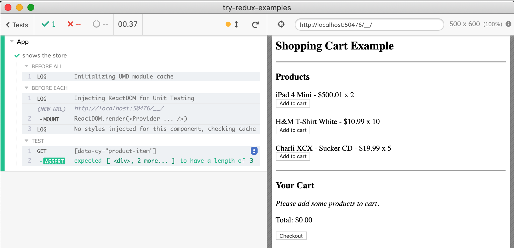
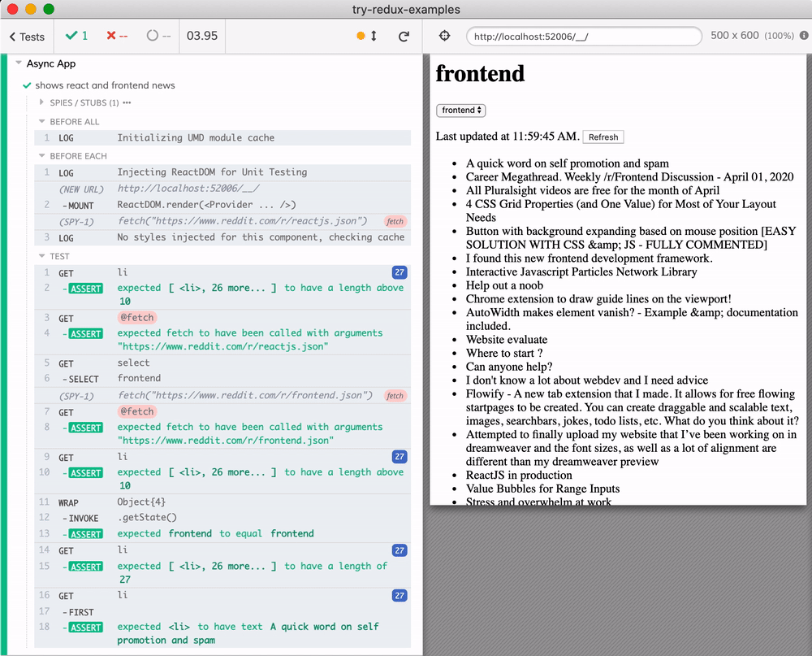

# Redux counter examples

> These examples taken from [redux site](https://redux.js.org/introduction/examples) and tested using [cypress-react-unit-test](https://github.com/bahmutov/cypress-react-unit-test)

   

- [counter](src/counter) from [codesandbox](https://codesandbox.io/s/github/reduxjs/redux/tree/master/examples/counter)
- [shopping-cart](src/shopping-cart) from [codesandbox](https://codesandbox.io/s/github/reduxjs/redux/tree/master/examples/shopping-cart)
- [async actions](src/async) from [codesandbox](https://codesandbox.io/s/github/reduxjs/redux/tree/master/examples/async)

See [cypress-react-unit-test](https://github.com/bahmutov/cypress-react-unit-test) and [cypress.json](cypress.json)

Shopping cart App component test

Reddit async reader App component test

## Exercises

- clone this repo
- install dependencies with `npm install`
- open Cypress: `npm run open` or `npx cypress open`

If you want to try writing Cypress unit tests against the React code, good candidates for rewriting are:

- [src/shopping-cart/components/Product.spec.js](src/shopping-cart/components/Product.spec.js)
- [src/shopping-cart/components/ProductItem.spec.js](src/shopping-cart/components/ProductItem.spec.js)
- easy unit tests in [src/shopping-cart/reducers](src/shopping-cart/reducers)
- continue the entire app test in [src/shopping-cart/containers/App.cy-spec.js](src/shopping-cart/containers/App.cy-spec.js)
- continue testing async Reddit reader in [src/async/containers](src/async/containers) and its individual components
